<!-- Generated from Day01/README-practice.source.md by tools/render-math.mjs — do not edit by hand. -->

# Day 1 — Practice problems (matrices & linear maps)

Extra drill problems in the spirit of introductory linear algebra for ML. **All numbers below are original** (not taken from any particular worksheet). Math follows **GitHub’s Markdown math** ([MathJax](https://docs.github.com/en/get-started/writing-on-github/working-with-advanced-formatting/writing-mathematical-expressions)): **inline** math with `$...$`, and **display** math in fenced blocks tagged with the `math` language (same pattern as [Day 1 index — How to read the math](00-INDEX.md#how-to-read-the-math)). Notation uses $A^\top$ for transpose; avoid unsupported macros such as `\operatorname`.

> **Reading comfort:** Applies to all Markdown in this repo—see **[Reading comfort](../README.md#reading-comfort)** in the root `README.md`.

> **GitHub rendering:** Section titles use HTML (`<h2 id="sec1">` …) for stable **Contents** links. **Display** math in ` ```math ` fences is **pre-rendered to PNG** in [`README-practice.md`](README-practice.md) (generated—do not edit that file by hand). **Inline** `$...$` still uses GitHub MathJax; for column vectors in inline math, `\cr` between rows avoids `\\` being mangled.

**How to use this page:** Each section starts with **Teaching the idea**—intuition first, then rules, then typical mistakes. Read that block *before* the problem if you are new to the topic; use the problem to check understanding. The **Solution** then shows the calculation with short notes on *why* each step is legal.

---

## Contents

1. [Transpose and AA<sup>T</sup>](#sec1)
2. [Products AB and BA](#sec2)
3. [Scalar multiplication and addition](#sec3)
4. [Distributive law](#sec4)
5. [Plane rotation](#sec5)
6. [Eigenvalues (2×2)](#sec6)
7. [Rank (3×3)](#sec7)
8. [Quick reference](#sec-ref)

---

<h2 id="sec1">1. Transpose and AA<sup>T</sup></h2>

### Teaching the idea

**Intuition.** The **transpose** $A^\top$ “flips” the matrix: rows become columns and columns become rows. If $A$ has shape $m \times n$, then $A^\top$ has shape $n \times m$. Entrywise, the relationship between entries is:

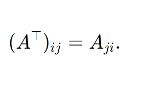


**Why multiply $A$ by $A^\top$?** For a **tall** matrix $A$ ($m$ rows, $n$ columns), the product $AA^\top$ has size $m \times m$ (square). You can always form it: the inner dimensions are $n$ and $n$. Each number $(AA^\top)_{ij}$ is the **dot product** of row $i$ of $A$ with row $j$ of $A$—because column $j$ of $A^\top$ is exactly row $j$ of $A$ written as a column. So $AA^\top$ packages “how similar are all pairs of rows of $A$” in one matrix. That is why it is **symmetric** (same dot product if you swap $i$ and $j$). The companion $A^\top A$ is $n \times n$ and encodes dot products between **columns** of $A$. Both show up in least squares, Gram matrices, and covariance-style ideas.

**Rules to remember** (transpose of a product reverses order):

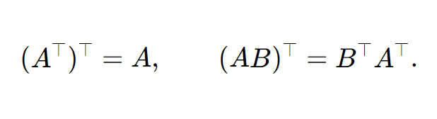


**Beginner pitfalls:** (1) Do not confuse $AA^\top$ with $A^\top A$—they have different sizes unless $A$ is square. (2) For a **row** vector $\mathbf{r}$, $\mathbf{r}^\top$ is a column; transposing twice returns the original shape.

### Problem

Let

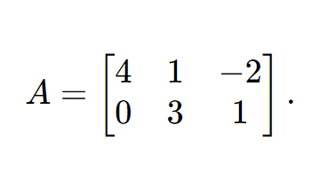


Compute $AA^\top$.

### Solution

**Step 1 — write $A^\top$.** Swap rows and columns of $A$:

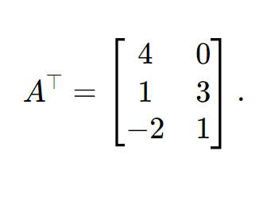


**Step 2 — size check.** $A$ is $2 \times 3$, $A^\top$ is $3 \times 2$, so $AA^\top$ is $2 \times 2$.

**Step 3 — fill entries.** Row $i$ of $A$ times column $j$ of $A^\top$ equals row $i$ of $A$ dot row $j$ of $A$:

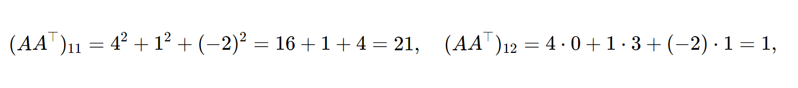


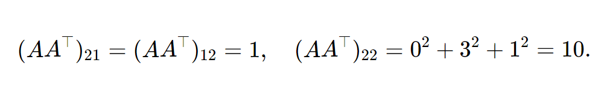


So

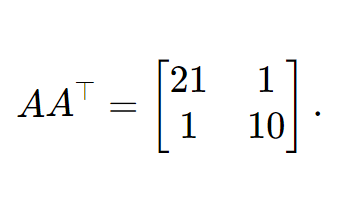


**Sanity check:** the result is symmetric (as theory predicts). If you ever get $AA^\top$ not symmetric, recheck arithmetic.

---

<h2 id="sec2">2. Products AB and BA (not commutative)</h2>

### Teaching the idea

**Intuition.** Matrix multiplication is **not** like multiplying numbers. The product $AB$ means: “apply $B$ first, then $A$” when you think of matrices as **linear maps**—but when you compute by hand, you use the **row–column rule**: entry $(i,j)$ of $AB$ is (row $i$ of $A$) $\cdot$ (column $j$ of $B$).

**When is $AB$ defined?** The width of $A$ (number of columns) must equal the height of $B$ (number of rows). If $A$ is $m \times n$ and $B$ is $n \times p$, then $AB$ is $m \times p$. If you try $BA$, you need $B$ to have $p$ rows and $A$ to have $m$ columns, so $p = m$ for $BA$ to exist. In our example, $A$ is $2 \times 3$ and $B$ is $3 \times 2$: both $AB$ and $BA$ exist, but $AB$ is $2 \times 2$ and $BA$ is $3 \times 3$. They are **different sizes**, so they cannot be the same matrix—even before you multiply numbers.

**Why “order matters”:** In general $AB \neq BA$. Even for two square matrices of the same size, equality is the exception, not the rule.

**Beginner pitfalls:** (1) Multiplying elementwise like $A \odot B$ (Hadamard)—that is **wrong** for standard matrix product unless you are explicitly told to use it. (2) Forgetting that $(AB)_{ij}$ uses **entire** row $i$ and column $j$, not a single entry.

### Problem

Let

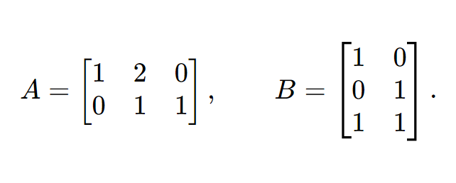


Compute $AB$ and $BA$. Are they equal?

### Solution

**Product $AB$** ($2 \times 2$):

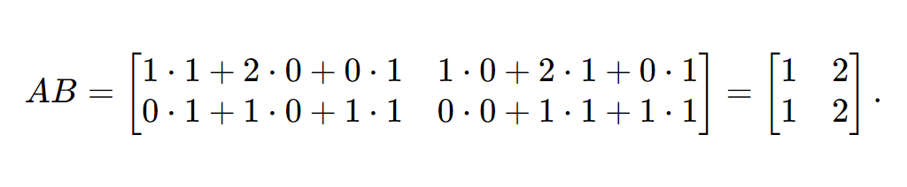


**Product $BA$** ($3 \times 3$):

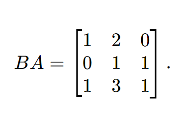


They are **not equal** (different shapes). This illustrates that matrix multiplication is **not** commutative in general.

**Takeaway:** Always write down **sizes** before you claim two products are “the same.”

---

<h2 id="sec3">3. Scalar multiplication and matrix addition</h2>

### Teaching the idea

**Intuition.** Matrices of the same shape can be **added** like adding two tables cell by cell: $(A+B)_{ij} = A_{ij} + B_{ij}$. **Scalar multiplication** scales every entry: $(\alpha A)_{ij} = \alpha A_{ij}$. So $2A + B$ means “double every entry of $A$, then add the corresponding entry of $B$.” There is nothing mysterious—just arithmetic in a grid.

**Why it matters in ML:** A batch of gradients is a matrix; an update like $\theta \leftarrow \theta - \eta G$ is exactly this structure (scalar $\eta$ times matrix $G$, added to parameters). The set of all $m \times n$ real matrices is a **vector space**: you can add matrices and scale them, and the usual rules (associativity, distributivity of scalars) hold.

**Algebra rules:** $\alpha(A+B) = \alpha A + \alpha B$; $(\alpha + \beta)A = \alpha A + \beta A$.

**Beginner pitfalls:** (1) You cannot add $A$ and $B$ if they have different shapes. (2) **Parentheses matter:** $2(A+B) = 2A + 2B$, which is different from $2A + B$ (the second expression adds only one copy of $B$).

### Problem

Let

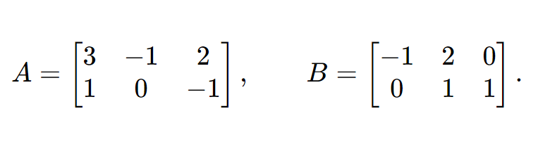


Find $2A + B$.

### Solution

**Step 1 — scale $A$:** multiply each entry by $2$.

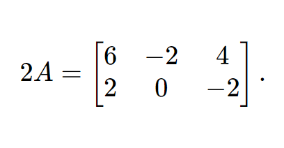


**Step 2 — add $B$ entrywise:** $(2A+B)_{ij} = (2A)_{ij} + B_{ij}$.

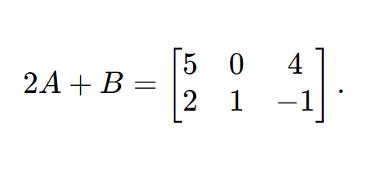


---

<h2 id="sec4">4. Distributive law</h2>

Key identity (in display math so it does not break across lines on GitHub):

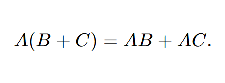


### Teaching the idea

**Intuition.** The **distributive law** says you may either add $B$ and $C$ first and then multiply by $A$ on the left, or multiply $A$ with $B$ and $A$ with $C$ separately and add the results. That matches what we expect from **linearity**: a linear map preserves sums, so $A(B+C)$ and $AB+AC$ should be the same object. In symbols, if $f(\mathbf{x}) = A\mathbf{x}$, then $f(\mathbf{u}+\mathbf{v}) = f(\mathbf{u}) + f(\mathbf{v})$; block matrices behave the same way.

**When it applies:** $B$ and $C$ must have the same shape, and $A$’s column count must match their row count (so $A(B+C)$ and $AB$, $AC$ are all defined).

**Why verify with numbers?** Proving the identity in general is one thing; doing a small example builds muscle memory for matrix multiplication and shows you are not mixing up “add first” vs “multiply first.”

**Beginner pitfalls:** (1) Distributivity works for **left** multiplication $A(B+C)$ and also for **right** multiplication $(B+C)A = BA + CA$, but **not** for mixed orders like $A(BA)$—always check parentheses. (2) **Do not** try to “distribute” $A(B + C)$ into $AB + C$ unless $C$ is zero—both terms must be hit by $A$.

### Problem

Let

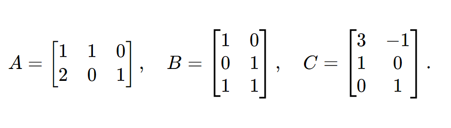


Compute $A(B+C)$ and $AB + AC$, and confirm they agree.

### Solution

**Sum:**

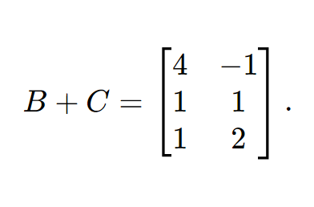


**Left-hand side:**

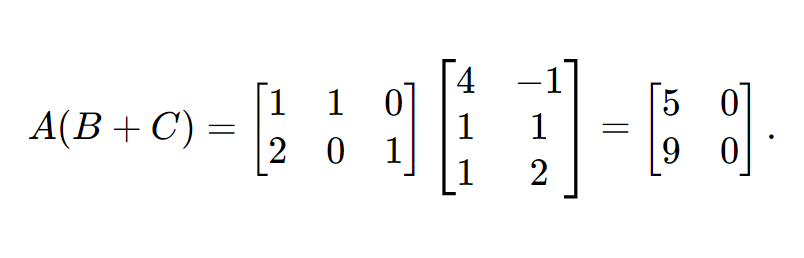


**Right-hand side:** First,

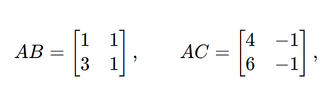


so

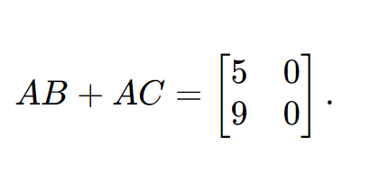


Same matrix; distributivity checks out.

**Interpretation:** You computed the same $2 \times 2$ matrix two different ways—so the algebraic rule matches the numeric work.

---

<h2 id="sec5">5. Plane rotation of vectors</h2>

### Teaching the idea

**Intuition.** In the plane, **rotating every vector** by a fixed angle $\theta$ around the origin is a **linear map**: rotating $\mathbf{u}+\mathbf{v}$ gives the same result as rotating $\mathbf{u}$ and $\mathbf{v}$ and then adding them; rotating $c\mathbf{u}$ is $c$ times the rotated $\mathbf{u}$. So it must be representable by a **matrix** $R(\theta)$. For **counterclockwise** rotation by $\theta$, the standard form is

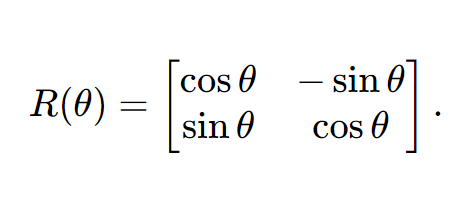


**How to read it:** The first column is where the basis vector $\mathbf{e}_1 = (1,0)^\top$ goes after rotation; the second column is where $\mathbf{e}_2 = (0,1)^\top$ goes. That fully determines the map.

**Applying to any vector:** Stack the components of $\mathbf{x}$ in a column; compute $R(\theta)\mathbf{x}$ with matrix–vector multiplication (same dot-product rule as rows times column).

**Beginner pitfalls:** (1) **Clockwise** vs counterclockwise: the formula above is **counterclockwise** (positive $\theta$ in the usual math convention). (2) Angles must be in **radians** in some software, but here we give exact trig values for $60^\circ$ so you can work by hand. (3) Rotation is linear **about the origin**; moving a shape “in space” without fixing the origin uses **affine** ideas (translation + linear part).

### Problem

Rotate each column vector by **$60^\circ$** counterclockwise:

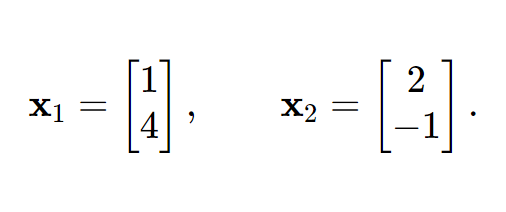


Use $\cos 60^\circ = \tfrac{1}{2}$ and $\sin 60^\circ = \tfrac{\sqrt{3}}{2}$.

### Solution

**Build $R(60^\circ)$** with $\cos 60^\circ = \tfrac{1}{2}$, $\sin 60^\circ = \tfrac{\sqrt{3}}{2}$:

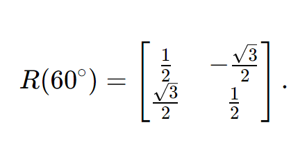


**First vector:** multiply $R$ by $\mathbf{x}_1$ (first component of row 1 times $x_1$ plus second component times $x_2$):

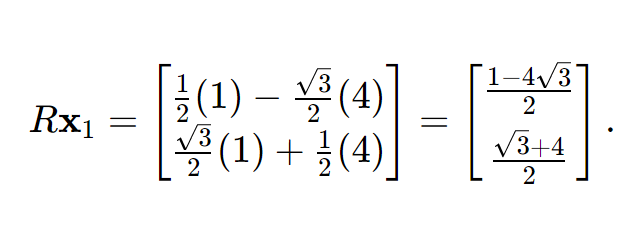


**Second vector:** same rule for $\mathbf{x}_2$:

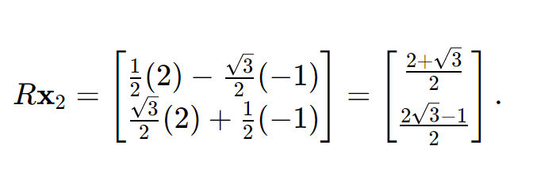


**Geometric check (optional):** sketch $\mathbf{x}_1$ in the first quadrant; after $60^\circ$ CCW, the vector should rotate toward the positive $y$-axis—your new coordinates should match that picture qualitatively.

---

<h2 id="sec6">6. Eigenvalues and eigenvectors (2×2)</h2>

### Teaching the idea

**Intuition.** Most of the time, multiplying by $A$ **changes both the length and direction** of a vector. An **eigenvector** is a special direction where $A$ only **stretches** (or reverses) the vector: $A\mathbf{v} = \lambda\mathbf{v}$. The scalar $\lambda$ is the **eigenvalue** (how much stretch; negative means opposite direction). The zero vector is never counted as an eigenvector—every matrix would satisfy $A\mathbf{0} = \lambda\mathbf{0}$.

**How to find $\lambda$:** Eigenvalues are roots of $\det(A - \lambda I) = 0$. For $2 \times 2$, $A - \lambda I$ is still $2 \times 2$, and the determinant is a **quadratic** in $\lambda$—so at most two eigenvalues (over the reals).

**How to find $\mathbf{v}$** after you know $\lambda$:** Solve the homogeneous system $(A - \lambda I)\mathbf{v} = \mathbf{0}$. There are infinitely many eigenvectors (any nonzero scalar multiple), so you only need **one** nonzero solution per eigenvalue.

**Why eigenstuff matters in ML:** Many algorithms use **principal directions** of variation (PCA), **stability** of iterations (eigenvalues of Jacobians), and **spectral** views of graphs and kernels. The $2 \times 2$ case is where you learn the pattern without heavy notation.

**Beginner pitfalls:** (1) Forgetting the ${-}\lambda$ entries on the diagonal when forming $A - \lambda I$. (2) Plugging an eigenvalue into $\det(A - \lambda I)$ to “check”—you should get **zero**, not an eigenvector. (3) Confusing eigenvector with eigenvalue—one is a vector, one is a scalar.

### Problem

Let

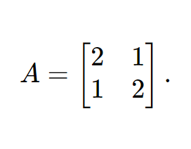


Find all eigenvalues and corresponding eigenvectors.

**Tip:** After you find a candidate eigenvector $\mathbf{v}$ for each eigenvalue $\lambda$, a good habit is to **verify** $A\mathbf{v} = \lambda\mathbf{v}$ with one matrix–vector multiply per pair.

### Solution

**Step 1 — characteristic polynomial.** Form $A - \lambda I$ and take the determinant:

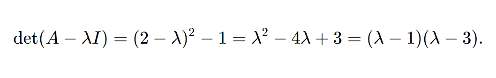


Eigenvalues: $\lambda_1 = 1$, $\lambda_2 = 3$.

**Step 2 — eigenvectors for $\lambda = 1$.** Solve $(A - I)\mathbf{v} = \mathbf{0}$:

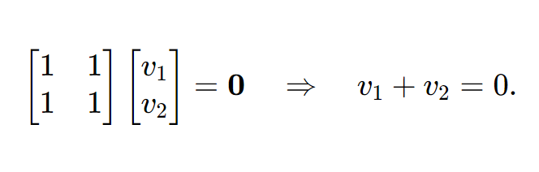


Pick $v_1 = 1$, then $v_2 = -1$. One eigenvector is $\mathbf{v}_1 = \begin{bmatrix} 1 \cr -1 \end{bmatrix}$ (any nonzero scalar multiple).

**Step 3 — eigenvectors for $\lambda = 3$.** Solve $(A - 3I)\mathbf{v} = \mathbf{0}$:

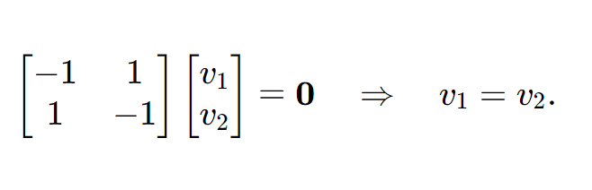


One eigenvector is $\mathbf{v}_2 = \begin{bmatrix} 1 \cr 1 \end{bmatrix}$.

**Verification (recommended):** $A\mathbf{v}_1 = A\begin{bmatrix} 1 \cr -1 \end{bmatrix} = \begin{bmatrix} 1 \cr -1 \end{bmatrix} = 1\,\mathbf{v}_1$, and $A\mathbf{v}_2 = A\begin{bmatrix} 1 \cr 1 \end{bmatrix} = \begin{bmatrix} 3 \cr 3 \end{bmatrix} = 3\,\mathbf{v}_2$—each output equals eigenvalue times input.

---

<h2 id="sec7">7. Rank of a matrix (3×3)</h2>

### Teaching the idea

**Intuition.** Think of the matrix $A$ as a list of **row vectors** (or columns). The **rank** counts how many of those rows are **genuinely new directions**—after you eliminate duplicates that are just combinations of earlier rows. If one row is “row 1 + row 2,” it does not add a new direction; rank drops.

**Equivalent definitions (for beginners, use one):**  
- **Row rank:** number of nonzero rows after **Gaussian elimination** to row echelon form (count **pivots**).  
- **Column rank:** dimension of the space spanned by columns—**Theorem:** row rank = column rank, so we just say **rank**.

**What rank tells you:** If $A$ is $m \times n$, then $\mathrm{rank}(A) \le \min(m,n)$. Full rank for a square matrix means **invertible** (for square matrices). Rank less than $n$ means some columns are redundant—dependencies among features in a data matrix.

**Beginner pitfalls:** (1) Confusing “rank” with “size of matrix.” (2) Thinking a zero row in the middle means you stop—eliminate **all** rows below pivots to see the true rank. (3) **Swapping** rows is allowed in elimination; scaling and adding rows are allowed—do not change rank accidentally by invalid operations.

### Problem

Find the rank of

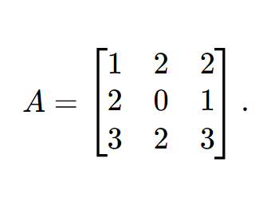


### Solution

**Step 1 — look for dependence.** Check whether a row is a combination of others. Here row 1 plus row 2 gives $[1+2,\, 2+0,\, 2+1] = [3,2,3]$, which is row 3. So the rows are linearly dependent; rank is at most $2$.

**Step 2 — eliminate.** Subtract $2 \times$ row 1 from row 2, and $3 \times$ row 1 from row 3:

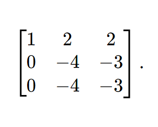


Then subtract row 2 from row 3:

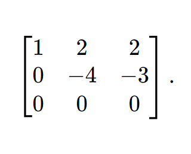


**Step 3 — count pivots.** There are leading entries (pivots) in columns 1 and 2, so

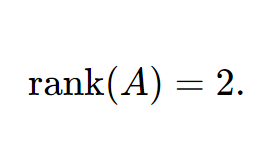


**Interpretation:** The first two rows are not multiples of each other, so they contribute two independent directions; the third row adds nothing new. The column space is a **plane** through the origin in $\mathbb{R}^3$ (a 2-dimensional subspace).

---

<h2 id="sec-ref">Quick reference (formulas)</h2>

Below, each fact is in its own **display** block so GitHub does not split symbols across lines.

**Transpose — entry and product rule**

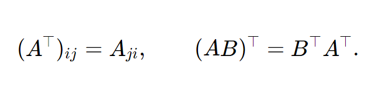


*Plain words:* flip rows/columns; for a product, reverse order when transposing.

**Gram matrices:** $AA^\top$ and $A^\top A$.

Symmetric; sizes $m \times m$ and $n \times n$ for $A \in \mathbb{R}^{m \times n}$. *Plain words:* dot products of rows (or columns); both are square and symmetric.

**Products:** $AB$ versus $BA$.

Inner dimensions must match; usually:

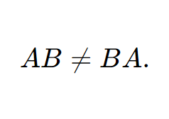


*Plain words:* order matters; shapes of $AB$ and $BA$ can differ.

**Distributivity**

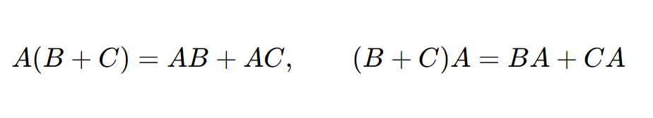


(when dimensions match). *Plain words:* like $a(b+c)=ab+ac$, but check shapes.

**Rotation in** $\mathbb{R}^2$: $R(\theta)$ as in section 5; orthogonal matrices satisfy $R^\top R = I$. *Plain words:* one angle for all vectors; lengths preserved.

**Eigenvalues**

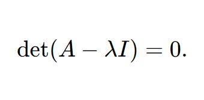


*Plain words:* the $\lambda$ for which $A\mathbf{v}=\lambda\mathbf{v}$ has a nonzero $\mathbf{v}$.

**Rank**

Count pivots after Gaussian elimination. *Plain words:* number of independent rows (or columns).

---

**Suggested order for first read:** sections 1 → 3 (arithmetic) → 2 (multiplication) → 4 → 5–7 (geometry and structure).

---

*Pair these drills with the numbered Day 1 topic notes (`01-`–`15-`) and the textbook exercises for full coverage.*
