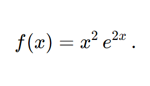
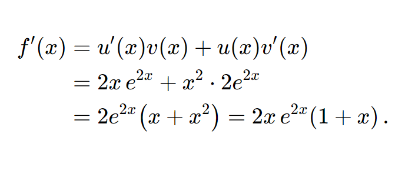
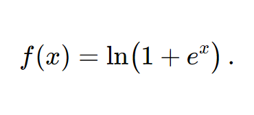
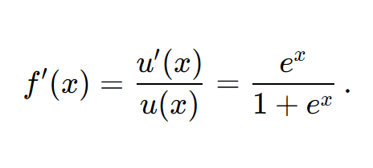
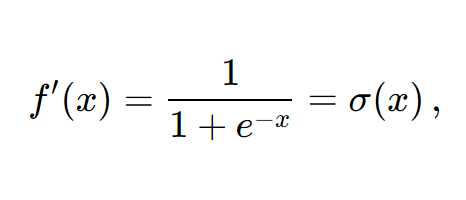
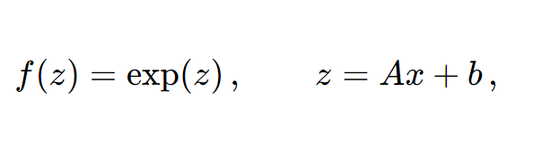
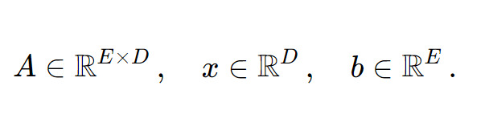
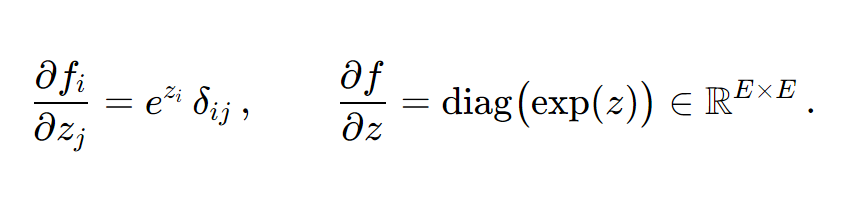
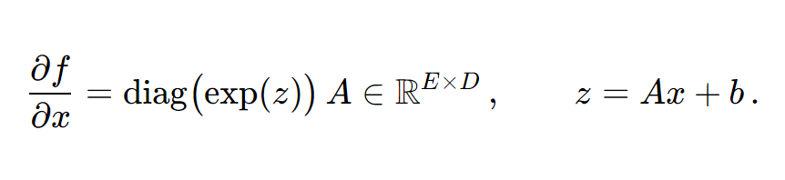

<!-- Generated from Day03/README-practice.source.md by tools/render-math.mjs — do not edit by hand. -->

# Day 3 — Practice (derivatives & chain rule)

Step-by-step **teaching**, **worked problems**, and **solutions**. These drills use **different functions** than the **assignment** (see local `README-assignment.source.md` if you use it) but build the **same skills**: product and chain rules, a common “activation” derivative, and Jacobians for $z=Ax+b$ composed with a coordinate-wise nonlinearity.

Aligned with **Chapter 5 — Vector calculus** in *Mathematics for Machine Learning* (see [`Day03.md`](Day03.md)). **Display** math uses ` ```math ` fences (pre-rendered to PNG in [`README-practice.md`](README-practice.md)).

Throughout, **$\ln$** is the **natural logarithm**.

> **Reading comfort:** See the root [`README.md`](../README.md#reading-comfort).

**How to use:** Read each **Teaching the idea** block first, then try the **Problem** on your own, then compare with the **Solution**.

---

## Contents

1. [Product rule — $f(x)=x^2 e^{2x}$](#sec1)
2. [Softplus — $f(x)=\ln(1+e^x)$](#sec2)
3. [Chain rule — $f(z)=\exp(z)$ with $z = Ax + b$](#sec3)

---

<h2 id="sec1">1. Product rule — $f(x)=x^2 e^{2x}$</h2>

### Teaching the idea

- **Product rule:** $(uv)' = u'v + uv'$.
- **Chain rule:** $\dfrac{d}{dx}e^{g(x)} = g'(x)\,e^{g(x)}$. Here $g(x)=2x$, so $\dfrac{d}{dx}e^{2x}=2e^{2x}$.
- This problem **does not** use logarithms; it isolates product + exponential chain rule.

### Problem

Compute $f'(x)$ for




### Solution

Let $u(x)=x^2$ and $v(x)=e^{2x}$. Then $u'(x)=2x$ and $v'(x)=2e^{2x}$.




---

<h2 id="sec2">2. Softplus — $f(x)=\ln(1+e^x)$</h2>

### Teaching the idea

The **softplus** $\mathrm{softplus}(x)=\ln(1+e^x)$ is a smooth approximation to $\max(0,x)$ and appears in variational inference and smooth ReLUs. Its derivative is the **logistic sigmoid** $\sigma(x)=\dfrac{1}{1+e^{-x}}$.

### Problem

Compute $f'(x)$ for




### Solution

Let $u(x)=1+e^x$, so $f(x)=\ln u(x)$ and $u'(x)=e^x$. By the chain rule,




Multiply numerator and denominator by $e^{-x}$:




the logistic sigmoid. Equivalently $\displaystyle f'(x)=\frac{e^x}{1+e^x}$.

---

<h2 id="sec3">3. Chain rule — $f(z)=\exp(z)$ with $z = Ax + b$</h2>

### Teaching the idea

- **Affine map:** $z=Ax+b$ has Jacobian $\dfrac{\partial z}{\partial x}=A\in\mathbb{R}^{E\times D}$.
- **Element-wise $\exp$:** If $f_i(z)=e^{z_i}$, then $\dfrac{\partial f_i}{\partial z_j}=e^{z_i}\delta_{ij}$; the Jacobian is $\mathrm{diag}(\exp(z))$.
- **Compose:** $\dfrac{\partial f}{\partial x}=\dfrac{\partial f}{\partial z}\dfrac{\partial z}{\partial x}$.

### Problem

Let $\exp$ apply **coordinate-wise:** $\exp(z)=[e^{z_1},\ldots,e^{z_E}]^\top$. Consider




with




Compute $\dfrac{\partial f}{\partial x}$. State the dimension of each Jacobian factor and of the result.

### Solution

**Step 1.** $z=Ax+b$ gives $\dfrac{\partial z}{\partial x}=A\in\mathbb{R}^{E\times D}$.

**Step 2.** For $f_i(z)=e^{z_i}$,




**Step 3.** Chain rule:




**Dimensions:**

| Object | Shape |
|--------|--------|
| $\dfrac{\partial z}{\partial x} = A$ | $E \times D$ |
| $\dfrac{\partial f}{\partial z} = \mathrm{diag}(\exp z)$ | $E \times E$ |
| $\dfrac{\partial f}{\partial x}$ | $E \times D$ |

**Entrywise:** $\displaystyle\frac{\partial f_i}{\partial x_j} = e^{z_i}\,A_{ij}$.
